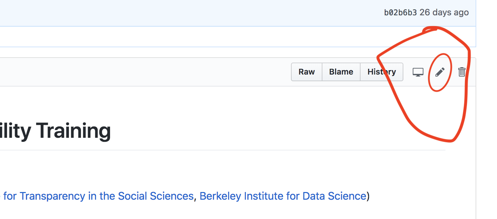

## The Claerbout Principle

> An article about computational science in a scientific publication is not the scholarship itself, it is merely advertising of the scholarship. The actual scholarship is the complete software development environment and the complete set of instructions which generated the figures.

[Buckheit \& Donoho, 1995](https://statweb.stanford.edu/~wavelab/Wavelab_850/wavelab.pdf)


## Organizing Principles  
1 - Use code (scripts), don't work by hand (Excel/spreadsheet, GUIs).
2 - Consider not saving statistical output, and just saving the code and raw data that generates it.
3 - Reproducibility--on your own machine across multiple runs, across machines, across researchers. 

## File Management \& Coding Suggestions
Begin with a logical file structure 
\includegraphics[height=2.25in]{../Images/files.png}

## General Coding Suggestions I (Christensen, Miguel & Freese, 2018)

- Make sure script files are self-contained: don't write code that only works if you run a group of other files previously in a specific order and then leave things hanging precariously. 
- Include tests in your code.   
This can alert you if output changes. 
- You can never comment your code too much. Truly explain rather than transliterating: \texttt{x=1} as "initialize the population count to 1" or "set x equal to 1."
 
- Indent your code.   

## General Coding Suggestions II
-  Once posted, any changes at all require a new file name. Better: use version control.  
-  Separate your data cleaning and analysis files. Don't make any new variables that need saving (or will be used by multiple analysis files) in an analysis file. It is far better to only create a variable once so you know that it is identical when used in different analysis files.


## General Coding Suggestions III
-  Name variables informatively: pick a side for indicator variables ``dead" (or ``living'') instead of ``status". (gender, race, etc.)
- Don't leave clutter around-delete temporary or unnecessary intermediate objects. 
\item You can use a prefix such as \texttt{x\_} or \texttt{temp\_} so you know which files or variables can easily be deleted later. Stata also has the \texttt{tempfile} and \texttt{tempvar} functionality.  
- Every variable should have a label. (If allowed for by the program.)
-  Use relative directory paths (such as `./Data` not `C:/Users/garret/Documents/Project/Data`) 


## Managing expectations


## The Primary Goal of Version Control (for us)

**The Goal:** keep track of any potentially meaningfull modification to your code (Git is also great for collaboration and exploring the work of others). 

##Strategy 1:  
1 - Agree on a naming convention with you co-authors (eg: YYYYMMDDfilename_INITALS).  
2 - Begin working from the last saved version (eg: `20180325demo_FH.do`).  
3 - At the end of the day, save on a new version (eg: `20180327demo_FH.do`).  

**Pros:** Easy adoption.   

**Cons:** Error prone, hard to document, lots of files for each document.   

##Strategy 2:  
1 - Name your file `filename` (ideally `01_filename`)  
2 - Take a snapshot of your work every time you complete relevant change (day, hour or minutes).  
3 - Update your entire working folder to the cloud.   


**Pros:** Error proof, seemless documentation, one file per document, track differences across all versions, meant to work with the cloud. 

**Cons:** Harder adoption.   

## Tips to ease the adoption: concepts. 
- **Git** is the software that does all the magic. **Github** is an implementation of Git that is easier to use, provides free (public) cloud service, and tools for collaboration. 
- A repository (**repo**) is a master folder that contains all your work. 
- Whenever you take a snapshot of your *saved* work, you **commit**
- When you make changes to your files in your computer, you are working **locally**, whenever you make changes to the files in the cloud you are working **remotelly**. 
- Whenever you want to update your *remote* *repo*, you **push**. If you want to update you *local* *repo*, you **pull**.
- When you copy a repo from another person into your online github account, you **fork** it. 
- When you start a repo from github.com (just created or forked), and want to download it for the first time to your local computer, you **clone** it. 

## Tips to ease the adoption: 4 min tutorial. 
1-  Create [github.com](github.com) account and sign in. [1 min]   
2-  Search `BITSS AIR`
3-  Fork it.[1min]   
4-  (You have left the BITSS account, and are now in your account)  
5- Click on `README.md`, then click on the pencil icon [1min]
  


## Tips to ease the adoption: 4 min tutorial. 
6-  Modify the title (`# AIR Reproducibility Training`) and click `Commit changes`    
7-  Go back to the root folder of the repo (`AIRMay2018`), and click `Clone or download`. And download as a zip. 

If  you had [Github Desktop](https://desktop.github.com/) (an app from the Github company) installed, you could clone the repo and play more.   

But I just wanted to give you a quick intro to:   
 - Find code of interest, fork it, edit it, make your first commit, and download. 

## Want to learn more: 
- [Great 20 min intro to Git by Alice Bartlett](https://www.youtube.com/watch?v=eWxxfttcMts)  

- [Great 2hr tutorial to Github by Jenny Bryan (git ninja)](https://www.rstudio.com/resources/videos/happy-git-and-gihub-for-the-user-tutorial/)  

- [Documentation from Matthew Gentzkow Jesse Shapiro](http://web.stanford.edu/~gentzkow/research/CodeAndData.pdf)  

- Come to 3-Day trainning (RT2) in Seattle ([Amsterdam next week](https://www.bitss.org/events/research-transparency-and-reproducibility-training-rt2-amsterdam/), [repo from last year](https://github.com/BITSS/RT2Berkeley2017))!


# Dynamic Documents

## Dynamic Documents For Computational Reproducibility
- Based on principles of *literate programming* aims at combining code and paper in one single document 
- Best framework to achieve the holy grail of **one-click reproducible workflow**
- Best two current implementations: `RMarkdown (R)` & `Jupyter (Python)`. `Stata` is catching up (dyndocs release [here](https://www.stata.com/new-in-stata/markdown/) and reviews [here](http://data.princeton.edu/stata/markdown/markstat.htm) and [here](https://www.bitss.org/2017/09/05/review-of-statas-dyndoc/))

## Currently code and narrative components live in separate universes 
   


## Dynamic Documents: integrate the two universes!  


  
## Dynamic Documents: A Recipe  

- 1 simple language that can combine text and code: `Markdown` 
- 1 statistical package to do the analysis (`R`, `Python`, `3S's?`)
- 1 machinery to combine analysis and text to create a single output: `Pandoc`
- [Optional-but-not-really] 1 program to bring all the elements together: RStudio/RMarkdown, Jupyter

## Basic Structure: Code Chunks and Inline

```{r smpl_yml3, eval=FALSE, echo=TRUE}
---
header
---
```

Body of text. 


To begin a piece of code ("code chunk"). Enclose them in the following expression (Ctrl/Cmd + shift/optn + i) 

````
```{r, eval=TRUE}`r ''`
here goes the code
```
````

To write inline use only one Backtick to open followed by an "r"" and one to close `` `r
1+1` `` in the output.
<!--
## Markdown laguange/syntax in 60 seconds


# One Type of Dynamic Document: R Markdown

## For our excercise: R Markdown  

- `R`: **open source** programming language design for statistical analysis.   
- RStudio: free software that provides and Integrated Development Environment (IDE)  
- RStudio combines all together: R + Markdown + Pandoc to produce multiple outputs
  


## R Markdown  


## Basic Structure

- A header
- Text
- Code: inline and chunks

## Basic Structure: Header


```{r smpl yml, eval=FALSE, echo=TRUE}
---
title: "Sample Paper"
author: "Fernando Hoces de la Guardia"
output: html_document
---
```  


## Basic Structure: Body of Text

```{r smpl_yml1, eval=FALSE, echo=TRUE}
---
header
---
```

This is where you write your paper. Nothing much to add. You can check Markdown [syntax here](https://www.rstudio.com/wp-content/uploads/2015/02/rmarkdown-cheatsheet.pdf). And it can use can type equations using LaTex syntax!

## Basic Structure: Code Chunks and Inline

```{r smpl_yml2, eval=FALSE, echo=TRUE}
---
header
---
```

Body of text. 


To begin a piece of code ("code chunk"). Enclose them in the following expression (Ctrl/Cmd + shift/optn + i) 

````
```{r, eval=TRUE}`r ''`
here goes the code
```
````

To write inline use only one Backtick to open followed by an "r"" and one to close `` `r
1+1` `` in the output.
--> 


```{r folder setup, echo=FALSE, eval=FALSE, warning=FALSE, message=FALSE}
cwd <- getwd() 
setwd("~/Desktop/sandbox/AIR2018/2-rep-workflow")

library(googlesheets)
suppressMessages(library(tidyverse))
token <- gs_auth()
saveRDS(token, file = "googlesheets_token.rds")
suppressMessages(gs_auth(token = "googlesheets_token.rds", verbose = FALSE))


if ( c("UG_anchoring") %in% dir() ) {
  unlink("UG_anchoring", recursive = TRUE)
}

dir.create("UG_anchoring")

setwd("UG_anchoring")
dir.create("rawdata")
dir.create("data")
dir.create("documentation")
dir.create("output")
dir.create("paper")
dir.create("scripts")

#readme_file <- file.path("README.md")
writeLines("# Little Experiment", "README.md")

aux.1 <- gs_title("Quick survey")
df <- gs_read(aux.1)
df <- df[!is.na(df$`ID number`),]
write_csv(df, path = "rawdata/raw_data.csv")

#upload  

setwd(cwd)
rm(token)
unlink("googlesheets_token.rds", recursive = TRUE)

#id <- fs_create("Little Experiment", "test data")
#fs_upload(id, "rawdata/raw_data.csv")

```

## P-hacking with the little experiment
- OLS 
- 3 outputs
- 2 Treatment vars  
- 7 Possible covariates (6 + none)  
- Total of 42 plausible models  

## P-Hacking in Action (Specification Curve)
```{r spec curve, echo=FALSE, eval=TRUE, message=FALSE, warning=FALSE}
library(tidyverse)
#download.file("https://ndownloader.figshare.com/files/10553269",
#              "raw_data.csv")
setwd("~/Desktop/sandbox/AIR2018/2-rep-workflow")

df <- read_csv(file = "UG_anchoring/rawdata/raw_data.csv")
# create treatment var

df <- df %>% mutate("treatment" = 
                      ifelse(`ID number` >= 960 & `ID number` <= 1000,1,NA)) %>% 
  mutate("treatment" = replace(treatment, `ID number` >= 10 & `ID number` <= 50, 0) )
# create a treatment var that treats out of range values as indicators of how the number
# was read, and defines treatment for any value above 500, and control otherwise
df <- df %>% mutate("treatment_generous" = 
                      ifelse(`ID number` >= 500,1,0))

#with(df, table(treatment, treatment_generous, useNA = "ifany"))

# 2 x (6+1) x 3 
# two def of treatment
# with and without covs
# Six combinations of controls
# Define outcome
# Three sensible ways to define outcome:
# (1) answer to Q1 in levels, (2) answer to Q2 en levels, 
# (3) average of Q1 and Q2 as fractions

df <- df %>% mutate("outcome_1" = `Dollar value to question #1`,
                    "outcome_2" = `Dollar value to question #2`) %>%
  rowwise() %>%
             mutate("outcome_3" = mean(c(outcome_1 / 1000, outcome_2 / 10),
                            na.rm = TRUE))
# handle missing and outliers
# 1 -  Values out of range: 
# Outcome and treatment variables: if close to plausible, then top code (<20% off). 
df <- df %>% mutate("treatment" = 
                      replace(treatment, 
                              `ID number` >= 0.8*950 & `ID number` <= 1.2*1000, 1), 
                    "treatment" = 
                      replace(treatment, 
                              `ID number` >= 0.8*10 & `ID number` <= 1.2*50, 0) , 
                    "outcome_1" = 
                      replace(outcome_1, 
                              outcome_1 > 1000 & outcome_1 <= 1.2*1000, 1000),
                    "outcome_2" = 
                      replace(outcome_2, 
                              outcome_2 > 10 & outcome_2 <= 1.2*10, 10),
                    "outcome_3" = 
                      replace(outcome_3, 
                              outcome_3 > 1 & outcome_3 <= 1.2*1, 1)
                    )
df$Experience = df$`Years of working experience`


df <- df %>% mutate("treatment" = 
                      replace(treatment, 
                              `ID number` >= 0.8*950 & `ID number` <= 1.2*1000, 1), 
                    "treatment" = 
                      replace(treatment, 
                              `ID number` >= 0.8*10 & `ID number` <= 1.2*50, 0) , 
                    "outcome_1" = 
                      replace(outcome_1, 
                              outcome_1 > 1000 & outcome_1 <= 1.2*1000, 1000),
                    "outcome_2" = 
                      replace(outcome_2, 
                              outcome_2 > 10 & outcome_2 <= 600, 10),
                    "outcome_3" = 
                      replace(outcome_3, 
                              outcome_3 > 1 & outcome_3 <= 40, 1)
                    )

#"Years of working experience"
#library(lubridate)
# Will exclude any observation that responded before begining the seminar, or after. 
#seminar_begins <- Sys.time()
#mdy_hms(df$Timestamp) - seminar_begins
# Missing values will be coded as NA
# Missing in either outcome or treatment var -> excluded variable
# Missing in covariates will be exlcuded of their corresponging analysis but keep for unconditional analysis. 
library(combinat)


match_variables <- c("Education", "Experience", "Gender")
combos <- sapply( seq(3), function(i) {
  as.list(as.data.frame(combn( x=match_variables, m=i ) ) )
})
forms <- unlist(combos,recursive=FALSE)
forms <- c("1", sapply( forms, function(x) paste(x,collapse="+")) )


results <- data.frame(coef = rep(NA, 48), 
           sd = rep(NA, 48), 
           model = as.character(rep("NA", 48)), stringsAsFactors=FALSE)

k <- 0

for (xvars in forms) {
  for (j in c("treatment", "treatment_generous")) {
    for (i in c("outcome_1","outcome_2","outcome_3" )) {
      model <- lm(paste(i, paste(j, xvars, sep = "+"), sep = "~"), data=df)
      k <- k + 1
      results[k,1:2] <- summary(model)$coefficients[2, 1:2]
      results[k,3] <- eval(model$call[[2]])
    } 
  }
}

results <- results[order(results[,1]/results[1:48,2]),]
ES <- results[1:48,1]/results[1:48,2]
plot(1:48, ES, ylim = c(-1.5,1.5), xlab = "Models")
abline(h = 0)
segments(1:48, ES - 1.96*ES, 1:48, ES + 1.96* ES)
```


<!--
```{r later, eval=FALSE}
#install.packages("DiagrammeRsvg")
# this codes comes from:
# https://scriptsandstatistics.wordpress.com/2017/12/22/how-to-draw-a-consort-flow-diagram-using-r-and-graphviz/
library(DiagrammeR)
library(DiagrammeRsvg)
library(rsvg)
library(webshot)

# webshot::install_phantomjs()


# Values ------------------------------------------------------------------
values <- c(210, 10, 200, 100, 100, 10, 10, 90, 90)
 
# Defining Text Labels ----------------------------------------------------
text <- c('Assessment for\neligibility',
          'Excluded',
          'Randomized',
          'Allocated to\nintervention',
          'Allocated to\nintervention',
          'Lost to follow-up',
          'Lost to follow-up',
          'Analysed',
          'Analysed')
 
# Defining Function -------------------------------------------------------
paste1 <- function(x, y){
  paste0(x, ' (n=', y, ')')
}
 
# Concatenating Values and Text Labels ------------------------------------
LABS <- paste1(text, values)


ndf <-
  create_node_df(
    n = 21,
    label = c('Enrollment', 'Allocation', 'Follow-Up', 'Analysis',
              LABS, rep("", 8)),
    style = c(rep("solid", 13), rep('invis', 8)),
    shape = c(rep("plaintext", 4), 
              rep("box", 9),
              rep("point", 8)),
    width = c(rep(2, 4), rep(2.5, 9), rep(0.001, 8)),
    hight = c(rep(0.5, 13), rep(0.001, 8)),
    fontsize = c(rep(14, 4), rep(10, 17)),
    fontname = c(rep('Arial Rounded MT Bold', 4), rep('Courier New', 17)),
    penwidth = 2.0,
    fixedsize = "true")

edf <-
  create_edge_df(
    arrowhead = c(rep('none', 3), rep("vee", 3), rep('none', 2), "vee", rep('none', 6),
                  rep("vee", 3), rep("none", 3), "vee", rep("none", 10)),
    color = c(rep('#00000000', 3), rep('black', 6), rep('#00000000', 6),
              rep('black', 3), rep('#00000000', 3), rep('black', 1),
              rep('#00000000', 2), rep('black', 2), 
              rep('#00000000', 6)),
    constraint = c(rep("true", 18), rep('false', 14)),
    from = c(1, 19, 20, 16, 8, 10, # column 1
             5, 14, 7, 15, 2, 3, # column 2
             18, 6, 21, 17, 9, 11, # column 3
             1, 5, # row 1
             19, 14, # row 2
             20, 7, # row 3
             16, 15, # row 4
             8, 2, # row 5
             10, 3, # row 6
             12, 4), # row 7
    to = c(19, 20, 16, 8, 10, 12, # column 1
           14, 7, 15, 2, 3, 4, # column 2
           6, 21, 17, 9, 11, 13, # column 3
           5, 18, # row 1
           14, 6, # row 2
           7, 21, # row 3
           15, 17, # row 4
           2, 9, # row 5
           3, 11, # row 6
           4, 13)) # row 7

# Create Graph ------------------------------------------------------------
g <- create_graph(ndf, 
                  edf,
                  attr_theme = NULL)
 

```
## CONSORT diagram of our little experiment
```{r, echo=FALSE, eval=FALSE}
# Plotting ----------------------------------------------------------------
render_graph(g)

```

-->

## Back-up Demo: The Birthday Problem!
```{r global pars, eval=TRUE, echo=FALSE, results='hide'}
n.pers = 21
set.seed(1234)
```  
As an illustration lets write a report using the participants in this workshop to illustrate the famous [birthday problem](https://en.wikipedia.org/wiki/Birthday_problem). 

>What is the probability that at least two people this room share the same birthday?

>Is it something like $\frac{1}{365} \times N =$   `r round(1/365 * n.pers, 3)`?

## Create a new RMarkdown File

1 - In RStudio: `File-> New File -> RMarkdown...`  
2 - Name it, and save it.   
3 - Review/edit the header, and delete all the default body of text except for one code chunk.   
4 - Define a seed (`set.seed(1234)` and number of people in the room (`n.pers = ?`)

## The birthday problem: the math
Actually the math says otherwise: 
\begin{align} 
 1 - \bar p(n) &= 1 \times \left(1-\frac{1}{365}\right) \times \left(1-\frac{2}{365}\right) \times \cdots \times \left(1-\frac{n-1}{365}\right) \nonumber  \\  &= \frac{ 365 \times 364 \times \cdots \times (365-n+1) }{ 365^n } \nonumber \\ &= \frac{ 365! }{ 365^n (365-n)!} = \frac{n!\cdot\binom{365}{n}}{365^n}\\
p(n= `r n.pers`) &= `r  round(1 - factorial(n.pers) * choose(365,n.pers)/ 365^n.pers, 3)`  \nonumber
\end{align}

## Code for the math (<https://goo.gl/ZFQvba>)

Don't look at this: just copy and paste into your report
```{r math, eval=FALSE}
\begin{align} 
 1 - \bar p(n) &= 1 \times \left(1-\frac{1}{365}\right) 
 \times \left(1-\frac{2}{365}\right) \times \cdots \times 
 \left(1-\frac{n-1}{365}\right) \nonumber  \\  
 &= \frac{ 365 \times 364 \times \cdots \times 
   (365-n+1) }{ 365^n } \nonumber \\ 
 &= \frac{ 365! }{ 365^n (365-n)!} = 
   \frac{n!\cdot\binom{365}{n}}{365^n}\\
p(n= `r n.pers`) &= `r  
 round(1 - factorial(n.pers) * 
         choose(365,n.pers)/ 365^n.pers, 3)`\nonumber
\end{align}
```

## Don't like math? Let's run a simple simulation!   
 1 - Simulate 10,000 rooms with $n = `r n.pers`$ random birthdays, and store the results in matrix where each row represents a room.   
 2 - For each room (row) compute the number of unique birthdays.   
 3 - Compute the average number of times a room has `r n.pers` unique birthdays, across 10,000 simulations, and report the complement.    


## Code for the simulation (<https://goo.gl/ZFQvba>)  

```{r birthday prob, eval=TRUE, echo=TRUE}
birthday.prob = function(n.pers, n.sims) {
  # simulate birthdays
  birthdays = matrix(round(runif(n.pers * n.sims, 1, 365)), 
                      nrow = n.sims, ncol = n.pers)
  # for each room (row) get unique birthdays
  unique.birthdays = apply(birthdays, 1, unique)
  # Indicator with 1 if all are unique birthdays
  all.different = (lapply(unique.birthdays, length) == n.pers)
  # Compute average time all have different birthdays 
  result = 1 - mean(all.different)
return(result)
}
n.pers.param = 21
n.sims.param = 1e4
birthday.prob(n.pers.param,n.sims.param)
```

## Results   
- Many people originally think of a prob ~ $\frac{1}{365} \times N =$   `r round(1/365 * n.pers.param, 3)`
- However the true probability is of $p(n= `r n.pers.param`) = `r round(1 - factorial(n.pers.param) * choose(365,n.pers.param)/ 365^n.pers.param, 3)`$
- And the simulated probability is of  `r birthday.prob(n.pers = n.pers.param, n.sims = n.sims.param)`

## Final Remarks & More Resources
 - With DD with can achieve a one-click reproducible workflow.
 - This is particularly helpful to understand/present results that are hard to digest.
 - Stata just develop an internal version of DD for v15. [Review Here](https://www.bitss.org/2017/09/05/review-of-statas-dyndoc/)
 - More great examples [here](https://github.com/BITSS/Annual2017/tree/master/3-Rmarkdown)
 - Want to learn more: [great free books](https://bookdown.org/) (can you guess how they were written?)

## Bonus let's try and excercise in Stata (15) 
1- Go to github.com and search `dyndoc tier` or click here: [github.com/dvorakt/TIER_exercises](https://github.com/dvorakt/TIER_exercises).   
2- Download or clone the repo.   
3- Unzip it.   
4- Open Stata (15) and type `dyndoc filepath/dyndoc_debt_growth/debt and growth stata dyndoc.do", replace`
5- Go to the folder and click in `debt and growth stata dyndoc.html` 


