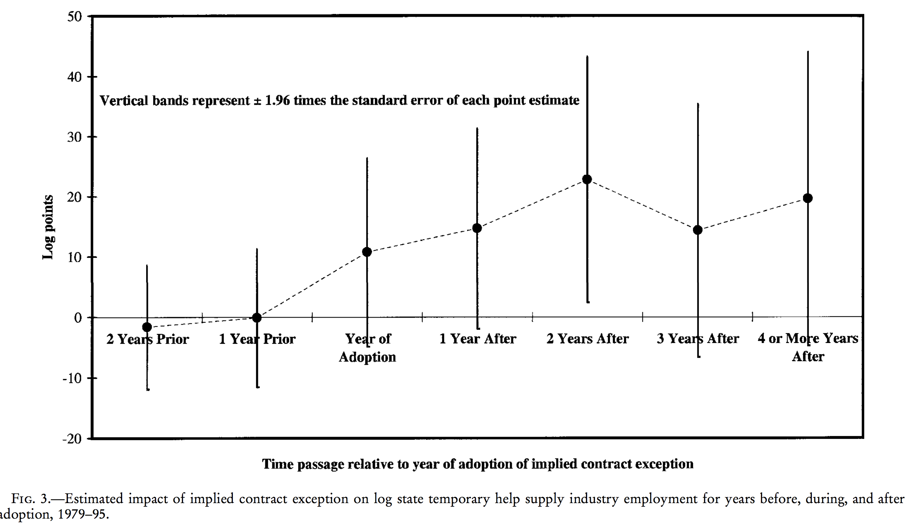

# Open Policy Analysis

## Research Transparency/Open Science

**Issues:**  

- Scientific misconduct  
- Publication Bias  
- Specification searching / P-Hacking  
- Replications problems  

**Solutions:**

- Ethical research
- Registrations
- PAPs
- Guidelines and Protocols


## New Dimension to Increase Transparency and Reproducibility: Policy Analysis
\centering
\includegraphics[height=3.2in]{../Images/fig1.png}


## Credibility Crisis
\centering
\includegraphics[height=3.2in]{../Images/fig2.png}


## Our Proposal for Open Policy Analysis
- Increase awareness (Motivational paper [here.](https://osf.io/preprints/bitss/jnyqh))

- Build guidelines and curriculum for open for policy analysis (similar to the TOP Guidelines for research). 

- Partner with agencies/think tanks interested in implementing these ideas.
[Example here.](https://rpubs.com/fhoces/dd_cbo_mw)

- Iterate.

## Traditional Policy Analysis
\centering
\includegraphics[height=3.2in]{../Images/traditional.png}

## Open Policy Analysis
\centering
\includegraphics[height=3.2in]{../Images/open.png}


# Dynamic Documents For Computational Reproducibility

## Dynamic Documents For Computational Reproducibility
- Based on principles of *literate programming* aims at combining code and paper in one single document 
- Best framework to achieve the holy grail of **one-click reproducible workflow**
- Best two current implementations: `RMarkdown (R)` & `Jupyter (Python)`.  `Stata` is catching up (dyndocs release [here](https://www.stata.com/new-in-stata/markdown/) and reviews [here](http://data.princeton.edu/stata/markdown/markstat.htm) and [here](https://www.bitss.org/2017/09/05/review-of-statas-dyndoc/))

## Currently code and narrative components live in separate universes 


## Dynamic Documents: integrate the two universes!  


  
## Dynamic Documents: A Recipe  

- 1 simple language that can combine text and code: `Markdown` 
- 1 statistical package to do the analysis (`R`, `Python`, `3S's?`)
- 1 machinery to combine analysis and text to create a single output: `Pandoc`
- [Optional-but-not-really] 1 program to bring all the elements together: RStudio/RMarkdown, Jupyter

## Markdown laguange/syntax in 60 seconds


# One Type of Dynamic Document: R Markdown

## For our excercise: R Markdown  

- `R`: **open source** programming language design for statistical analysis.   
- RStudio: free software that provides and Integrated Development Environment (IDE)  
- RStudio combines all together: R + Markdown + Pandoc to produce multiple outputs
  


## R Markdown  


## Basic Structure

- A header
- Text
- Code: inline and chunks

## Basic Structure: Header

```{r smpl yml, eval=FALSE, echo=TRUE}
---
title: "Sample Paper"
author: "Fernando Hoces de la Guardia"
output: html_document
---
```  

```{r global pars, eval=TRUE, echo=FALSE, results='hide'}
n.pers = 14
```  


## Basic Structure: Body of Text

```{r smpl_yml1, eval=FALSE, echo=TRUE}
---
header
---
```

This is where you write your paper. Nothing much to add. You can check Markdown [syntax here](https://www.rstudio.com/wp-content/uploads/2015/02/rmarkdown-cheatsheet.pdf). And it can use can type equations using LaTex syntax!

## Basic Structure: Code Chunks and Inline

```{r smpl_yml2, eval=FALSE, echo=TRUE}
---
header
---
```

Body of text. 


To begin a piece of code ("code chunk"). Enclose them in the following expression (Ctrl/Cmd + shift/optn + i) 

````
```{r, eval=TRUE}`r ''`
here goes the code
```
````

To write inline use only one Back-tick to open followed by an "r" and one to close `` `r
1+1` `` in the output.


```{r folder setup, echo=FALSE, eval=FALSE, warning=FALSE, message=FALSE}
cwd <- getwd() 
setwd("~/Desktop/sandbox/AIR2018/3-dynamicdocs")

library(googlesheets)
suppressMessages(library(tidyverse))
token <- gs_auth()
saveRDS(token, file = "googlesheets_token.rds")
suppressMessages(gs_auth(token = "googlesheets_token.rds", verbose = FALSE))


if ( c("UG_anchoring") %in% dir() ) {
  unlink("UG_anchoring", recursive = TRUE)
}

dir.create("UG_anchoring")

setwd("UG_anchoring")
dir.create("rawdata")
dir.create("data")
dir.create("documentation")
dir.create("output")
dir.create("paper")
dir.create("scripts")

#readme_file <- file.path("README.md")
writeLines("# Little Experiment", "README.md")

aux.1 <- gs_title("Quick survey")
df <- gs_read(aux.1)
df <- df[!is.na(df$`ID number`),]
write_csv(df, path = "rawdata/raw_data.csv")

#upload  

setwd(cwd)
rm(token)
unlink("googlesheets_token.rds", recursive = TRUE)

#id <- fs_create("Little Experiment", "test data")
#fs_upload(id, "rawdata/raw_data.csv")

```

## Little Demo: Our Little Experiment
**Can we p-hack it?**   

- OLS 
- 3 outputs
- 2 Treatment vars  
- 7 Possible covariates (6 + none)  
- Total of 42 plausible models  

## P-Hacking in Action (Specification Curve)
```{r spec curve, echo=FALSE, eval=TRUE, message=FALSE, warning=FALSE}
library(tidyverse)
#download.file("https://ndownloader.figshare.com/files/10553269",
#              "raw_data.csv")
setwd("~/Desktop/sandbox/AIR2018/3-dynamicdocs")

df <- read_csv(file = "UG_anchoring/rawdata/raw_data.csv")
# create treatment var

df <- df %>% mutate("treatment" = 
                      ifelse(`ID number` >= 960 & `ID number` <= 1000,1,NA)) %>% 
  mutate("treatment" = replace(treatment, `ID number` >= 10 & `ID number` <= 50, 0) )
# create a treatment var that treats out of range values as indicators of how the number
# was read, and defines treatment for any value above 500, and control otherwise
df <- df %>% mutate("treatment_generous" = 
                      ifelse(`ID number` >= 500,1,0))

#with(df, table(treatment, treatment_generous, useNA = "ifany"))

# 2 x (6+1) x 3 
# two def of treatment
# with and without covs
# Six combinations of controls
# Define outcome
# Three sensible ways to define outcome:
# (1) answer to Q1 in levels, (2) answer to Q2 en levels, 
# (3) average of Q1 and Q2 as fractions

df <- df %>% mutate("outcome_1" = `Dollar value to question #1`,
                    "outcome_2" = `Dollar value to question #2`) %>%
  rowwise() %>%
             mutate("outcome_3" = mean(c(outcome_1 / 1000, outcome_2 / 10),
                            na.rm = TRUE))
# handle missing and outliers
# 1 -  Values out of range: 
# Outcome and treatment variables: if close to plausible, then top code (<20% off). 
df <- df %>% mutate("treatment" = 
                      replace(treatment, 
                              `ID number` >= 0.8*950 & `ID number` <= 1.2*1000, 1), 
                    "treatment" = 
                      replace(treatment, 
                              `ID number` >= 0.8*10 & `ID number` <= 1.2*50, 0) , 
                    "outcome_1" = 
                      replace(outcome_1, 
                              outcome_1 > 1000 & outcome_1 <= 1.2*1000, 1000),
                    "outcome_2" = 
                      replace(outcome_2, 
                              outcome_2 > 10 & outcome_2 <= 1.2*10, 10),
                    "outcome_3" = 
                      replace(outcome_3, 
                              outcome_3 > 1 & outcome_3 <= 1.2*1, 1)
                    )
df$Experience = df$`Years of working experience`


df <- df %>% mutate("treatment" = 
                      replace(treatment, 
                              `ID number` >= 0.8*950 & `ID number` <= 1.2*1000, 1), 
                    "treatment" = 
                      replace(treatment, 
                              `ID number` >= 0.8*10 & `ID number` <= 1.2*50, 0) , 
                    "outcome_1" = 
                      replace(outcome_1, 
                              outcome_1 > 1000 & outcome_1 <= 1.2*1000, 1000),
                    "outcome_2" = 
                      replace(outcome_2, 
                              outcome_2 > 10 & outcome_2 <= 600, 10),
                    "outcome_3" = 
                      replace(outcome_3, 
                              outcome_3 > 1 & outcome_3 <= 40, 1)
                    )

#"Years of working experience"
#library(lubridate)
# Will exclude any observation that responded before begining the seminar, or after. 
#seminar_begins <- Sys.time()
#mdy_hms(df$Timestamp) - seminar_begins
# Missing values will be coded as NA
# Missing in either outcome or treatment var -> excluded variable
# Missing in covariates will be exlcuded of their corresponging analysis but keep for unconditional analysis. 
library(combinat)


match_variables <- c("Education", "Experience", "Gender")
combos <- sapply( seq(3), function(i) {
  as.list(as.data.frame(combn( x=match_variables, m=i ) ) )
})
forms <- unlist(combos,recursive=FALSE)
forms <- c("1", sapply( forms, function(x) paste(x,collapse="+")) )


results <- data.frame(coef = rep(NA, 48), 
           sd = rep(NA, 48), 
           model = as.character(rep("NA", 48)), stringsAsFactors=FALSE)

k <- 0

for (xvars in forms) {
  for (j in c("treatment", "treatment_generous")) {
    for (i in c("outcome_1","outcome_2","outcome_3" )) {
      model <- lm(paste(i, paste(j, xvars, sep = "+"), sep = "~"), data=df)
      k <- k + 1
      results[k,1:2] <- summary(model)$coefficients[2, 1:2]
      results[k,3] <- eval(model$call[[2]])
    } 
  }
}

results <- results[order(results[,1]/results[1:48,2]),]
ES <- results[1:48,1]/results[1:48,2]
plot(1:48, ES, ylim = c(-1.5,1.5), xlab = "Models")
abline(h = 0)
segments(1:48, ES - 1.96*ES, 1:48, ES + 1.96* ES)
```


# Practical Excercise #1

## Hands-on excercise: the birthday problem!

As an illustration lets write a report using the participants in this workshop to illustrate the famous [birthday problem](https://en.wikipedia.org/wiki/Birthday_problem). 

>What is the probability that at least two people this room share the same birthday?

>Is it something like $\frac{1}{365} \times N =$   `r round(1/365 * n.pers, 3)`?

## Goals for excercise #1  

**Primary Goals:**  
1 - Become familiar with your first DD.    
2 - Compile an empty (or default) DD into multiple formats.   
3 - Edit a DD with some narrative, some code (in R) and some math (optional).   
4 - Present all the results dynamically into multiple outputs.   

\pause 

**Secondary Goal:**    
1 - Expose you to some R programming.   
2 - Entertain you with a fun problem.  

## Create a new RMarkdown File

1 - In RStudio: `File-> New File -> RMarkdown...`  
2 - Name it, and save it as `/3-dynamicdocs/first_dd.Rmd`.   
3 - Review/edit the header, and delete all the default body of text except for one code chunk.   
4 - In that chunk define a seed (`set.seed(1234)` and number of people in the room (`n.pers = ?`).  
5 - Below the first chunk, write down a title (using `#`) and a brief description.

## The birthday problem: the math
Actually the math says otherwise: 
\begin{align} 
 1 -  p(n) &= 1 \times \left(1-\frac{1}{365}\right) \times \left(1-\frac{2}{365}\right) \times \cdots \times \left(1-\frac{n-1}{365}\right) \nonumber  \\  &= \frac{ 365 \times 364 \times \cdots \times (365-n+1) }{ 365^n } \nonumber \\ &= \frac{ 365! }{ 365^n (365-n)!} = \frac{n!\cdot\binom{365}{n}}{365^n}\\
p(n= `r n.pers`) &= `r  round(1 - factorial(n.pers) * choose(365,n.pers)/ 365^n.pers, 3)`  \nonumber
\end{align}

## Code for the math (`/3-dynamicdocs/first_dd_solution.Rmd`)

Not relevant to look at: just copy and paste lines 23-30 from the solutions into your dynamic document. 

```{r math, eval=FALSE}
\begin{align} 
 1 - \bar p(n) &= 1 \times \left(1-\frac{1}{365}
                                 \right) 
 \times ...
 A lot of equations using LateX syntax!
\end{align}
```

## Don't like math? Let's run a simple simulation!   
 1 - Simulate 10,000 rooms with $n = `r n.pers`$ random birthdays, and store the results in matrix where each row represents a room.   
 2 - For each room (row) compute the number of unique birthdays.   
 3 - Compute the average number of times a room has `r n.pers` unique birthdays, across 10,000 simulations, and report the complement.    


## Code for the simulation (`/first_dd_solution.Rmd`)  

```{r birthday prob, eval=TRUE, echo=TRUE}
birthday.prob = function(n.pers, n.sims) {
  # simulate birthdays
  birthdays = matrix(round(runif(n.pers * n.sims, 
                                 1, 365)), 
                      nrow = n.sims, ncol = n.pers)
  # for each room (row) get unique birthdays
  unique.birthdays = apply(birthdays, 1, 
                           function(x) 
                             length(unique(x)) )
  # Indicator with 1 if all are unique birthdays
  all.different = 1 * (unique.birthdays==n.pers)
  # Compute average time all have different birthdays 
  result = 1 - mean(all.different)
return(result)
}
n.pers.param = 31; n.sims.param = 1e4
birthday.prob(n.pers.param,n.sims.param)
```


## Results   
- Many people originally think of a prob ~ $\frac{1}{365} \times N =$   `r round(1/365 * n.pers.param, 3)`
- However the true probability is of $p(n= `r n.pers.param`) = `r round(1 - factorial(n.pers.param) * choose(365,n.pers.param)/ 365^n.pers.param, 3)`$
- And the simulated probability is of  `r birthday.prob(n.pers = n.pers.param, n.sims = n.sims.param)`


# Practical Excercise #2

## Hands-on excercise #2: Mostly Harmless Econometrics!

There is a [fantastic Github](https://github.com/vikjam/mostly-harmless-replication) repo that is reproducing results from MHE 

Lets use the of examples Figure [5.2.4](https://github.com/vikjam/mostly-harmless-replication/blob/master/05%20Fixed%20Effects%2C%20DD%20and%20Panel%20Data/Figure%205-2-4.r) to show how dynamic docs can be used in data analysis. 

## Figure to reproduce  


  
## Goals for excercise #2  

**Primary Goals:**  
1 - Demonstrate how the **entire workflow** of a study can fit into a DD.   
2 - Show how to add options to the header.  
3 - Demonstrate how a DD make code readable to non-coders.   

\pause 

**Secondary Goal:**    
1 - Expose you to some R programming.   

## Instructions to get started with excercise #2:

1 - Create a new blank `.Rmd` file (steps 1 - 3 in from previous ex.)
2 - Save it as `/3-dynamicdocs/Figure 5-2-4.Rmd`   
3 - Look at [this code](https://github.com/vikjam/mostly-harmless-replication/blob/master/05%20Fixed%20Effects%2C%20DD%20and%20Panel%20Data/Figure%205-2-4.r) behind figure 5.2.4.  
4 - Start building your own DD to describe what this code does. 

We will go step by step using `/3-dynamicdocs/Figure 5-2-4_solutions.Rmd` as back-up.

## Description

- Begin a new section (`##`), titled "Description"  

- Write a brief description of our goal in the DD.   

- You might want to insert a reference to the paper: [link here](http://economics.mit.edu/files/589).  

- Specific content not so relevant, just refer to "a treatment" and "a outcome".  

## Getting the raw data

- Begin a new section (`##`), titled "Raw Data".   
- Describe what you will do.  
- Create two code chunks:
````
```{r download data, eval=FALSE, echo=TRUE, 
warning=FALSE, results='hide', message=FALSE}`r ''`
here goes the code
```
````


## Cleaning the data

- Begin a new section (`##`), titled "Data Cleaning".   
- Describe what you will do:  
    - Restrict sample to years between 1979 and 1995 (inclusive)  
    - Guam from the sample (state = 98).   
- Create one code chunk:  
````
```{r data cleaning, echo=TRUE}`r ''`
here goes the code
```
````

- Add some description on the data (using dynamic reporting). See solutions (Figure `5-2-4_solutions.Rmd` line 58) for examples.   

## Build the analytic file

- Begin a new section (`##`), titled "Build analytic file".   
- Describe what you will do.   
- We need to construct the following variables:   
    - Log of total employment  
    - Normalize the year variable to 1978  
- Insert a new code chunk:

````
```{r analytic file, echo=TRUE}`r ''`
here goes the code
```
````

## Describe the model to estimate (optional)  

- Begin a new section (`##`), titled "Define model to estimate".   
- One line describing what we want to estimate (i.e. "We want to estimate a fixed effect model with lead and lag treatment variables").     
- A mathematical model that represents the equation to be estimated (look at solutions). 

## Vizualize the results (optional)  
- Begin a new section (`##`), titled "Vizualize the results".   
- One line describing what we want to estimate (i.e. "This estimates are then used to create figure 3 of the original paper, which is figure 5.2.4 in MHE.").  
````
```{r viz}`r ''`
here goes the code
```
````

## Practical Excercise #2  
- Run your version into multiple outputs.   
- Run the solutions version into multiple outputs.   
- Compare document with original version of the code.   

# Practical Excercise #3

## Goals for excercise #3  

**Primary Goals:**  
1 - Map the concepts of DD into Stata `dyndoc`.  
2 - Demonstrate how to execute a DD in Stata.  


## Hands-on excercise #3: Stata and TIER
1- Go to github.com and search `dyndoc tier` or click here: [github.com/dvorakt/TIER_exercises](https://github.com/dvorakt/TIER_exercises).   
2- Download or clone the repo.   
3- Unzip it.   
4- Open Stata (15), set working directory, and type `dyndoc "filepath/dyndoc_debt_growth/debt and growth stata dyndoc.do", replace`  
5- Go to the folder and click in `debt and growth stata dyndoc.html` 


# Final Remarks & More Resources

## Final Remarks & More Resources
 - With DD we can achieve a one-click reproducible workflow.
 - This is particularly helpful to understand/present results that are hard to digest.
 - More great examples in the workshop repo (`4-moredynamicdocs`).
 - Want to learn more: [great free books](https://bookdown.org/) (can you guess how they were written?)
